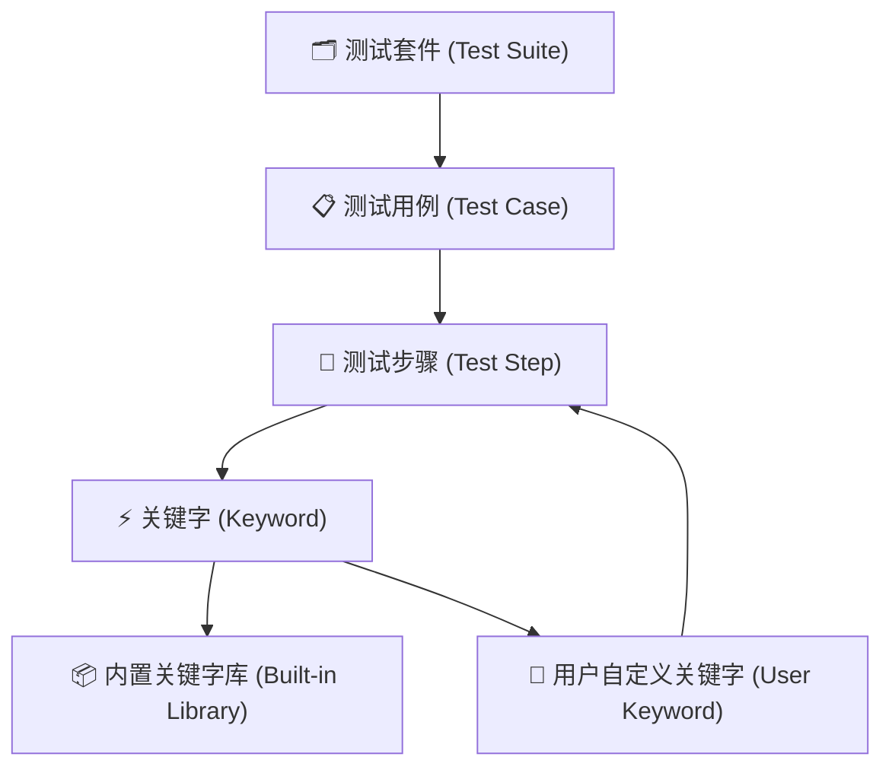
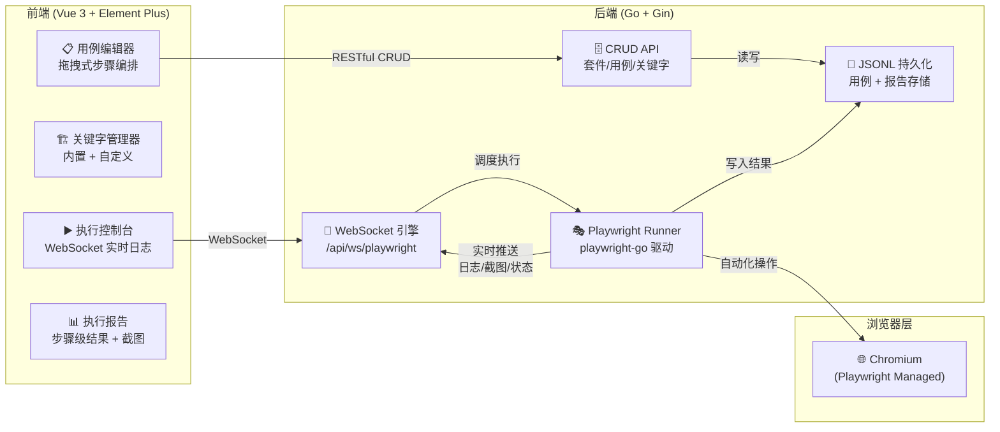

# 可视化 UI 自动化平台方案设计 (AutoTestCenter)

> [!IMPORTANT]
> **当前项目进度摘要 (2026-04-02)**
> - **阶段 1 (基础骨架):** ✅ **100% 完成**。后端 Playwright-Go 环境、数据模型、基于 JSONL 的 CRUD 服务已就绪；前端路由、Pinia Store 及用例仓库主页已实现。
> - **阶段 2 (用例编辑器):** ✅ **100% 完成**。实现三栏式拖拽编辑器 (`vuedraggable`)，支持关键字搜索、步骤编排、属性配置及变量引用。
> - **阶段 3 (执行引擎):** ✅ **100% 完成**。后端 `playwright_ws.go` WebSocket 引擎及前端 `Runner.vue` 实时执行控制台已开发完毕。
> - **阶段 4 (执行报告):** ⏳ 待开发，当前仅完成基础 Runner 执行态与截图/日志展示，尚未进入正式报告沉淀与查询能力建设。
> - **阶段 5 (元素探测器 Inspector):** ✅ **100% 完成**。已具备基于 Playwright 注入与 WebSocket 通信的可视化录制能力，并完成点击、输入、键盘操作录制打通。
> - **本轮新增能力:** Inspector 启动录制时自动补齐 `Launch + Goto`；点击录制默认新增 `Click` 卡片；支持录制 `Fill` 与 `Press(Enter/Tab/Escape)`；优化可交互元素 selector 策略。
> - **已修复问题:** 录制点击只覆盖已有步骤不新增卡片；录制时拦截页面原始跳转；Acceptance Report 统计卡图标响应式 warning。
> - **待办事项:** 进入 Phase 4 执行报告设计；继续增强 Inspector 对 `SelectOption`、复选框、单选框、等待步骤的自动生成能力。
> - **核心文件:** `server/services/playwright_ws.go`, `server/services/playwright_keywords.go`, `server/services/inspector_ws.go`, `src/views/UIAutoTest/Editor.vue`。

---

## 🏗️ 实施进度记录 (ChangeLog 风格)

### 2026-04-02
- **后端**: 完成 `playwright-go` 依赖集成与初始化。
- **后端**: 实现 `PlaywrightSuite`, `PlaywrightCase`, `TestStep` 模型。
- **后端**: 实现 `playwright_service.go` 处理 JSONL 持久化与 CRUD API。
- **后端**: 实现 `playwright_keywords.go` 提供 Playwright 操作映射。
- **后端**: 实现 `playwright_ws.go` 提供 WebSocket 实时执行引擎。
- **前端**: 创建 `UIAutoTest` 模块，注册路由。
- **前端**: 实现 `Editor.vue` 编辑器，集成 `vuedraggable` 实现步骤排序。
- **前端**: 完成 `KeywordPanel`, `StepFlow`, `PropertyPanel` 组件开发。
- **前端**: 完成 `Runner.vue` 执行控制台开发与 WebSocket 通信打通。
- **计划**: 确立 Inspector 元素探测器开发计划，决定采用“自研注入通信”机制替代官方 GUI，以提升平台深度集成体验。

### 2026-04-02 (Inspector 细节增强与体验修正)
- **后端**: 完成 `inspector_ws.go` 注入脚本增强，支持录制点击、输入、按键事件，并通过结构化 WebSocket 消息回传前端。
- **后端**: 优化 Inspector selector 生成策略，优先使用 `id`、`data-testid`、`name`、`aria-label`、`placeholder`、`title`、`value` 等稳定属性，降低百度/Google 等动态页面的执行超时概率。
- **后端**: 修复录制时对原页面点击行为的干扰，移除对导航类点击的默认拦截，保证百度贴吧、Google 搜索等原始跳转仍可正常发生。
- **后端**: 为关键字库新增 `Press` 关键字，并接入 `page.Press(selector, key)` 执行逻辑。
- **前端**: 修复 Inspector 录制时“只填充 selector、不新增步骤卡片”的问题，改为默认追加新的 `Click` step。
- **前端**: 在开启可视化录制时自动插入 `Launch` 与 `Goto` 两个基础步骤，保证录制结果具备最基本的可执行上下文。
- **前端**: 新增 `Fill` 与 `Press` 的录制接收逻辑，支持输入内容和回车等按键操作落成步骤卡片。
- **前端**: 更新 `StepFlow` 摘要展示逻辑，使 `Fill` 和 `Press` 步骤在中间步骤流中有更清晰的摘要表现。
- **前端**: 修复 Acceptance Report 页面统计卡图标被 Vue 做成响应式对象的 warning，使用 `markRaw` 规避不必要性能开销。

---

## 一、 目标与背景

在 TestCenter 现有平台基础上，新增一套**可视化 UI 自动化测试**模块。借鉴 Robot Framework 的"关键字驱动"设计理念，但将底层引擎从 Python + Selenium 替换为 **Go + Playwright-Go**，实现更高性能的浏览器自动化能力。用户可以在 Vue 3 前端界面上**零代码地编排、调试和执行** UI 自动化测试用例，并通过 WebSocket 实时查看执行过程与结果。

### 核心价值
- **零代码门槛**：测试人员通过拖拽/选择关键字来组装用例，无需编写 Go 或 Python 代码
- **实时可视化**：执行用例时通过 WebSocket 实时推送截图、日志、步骤状态，前端同步渲染
- **完全复用现有架构**：Go + Gin 后端、WebSocket 通信模式、JSONL 持久化、Vue 3 + Element Plus 前端

---

## 二、 核心概念模型（借鉴 Robot Framework）

### 2.1 数据模型层级



| 层级 | 说明 | 示例 |
|:---|:---|:---|
| **测试套件 (Suite)** | 最顶层容器，包含多个用例，可定义套件级变量和前置/后置操作 | `ShortsWave 登录模块回归套件` |
| **测试用例 (Case)** | 一条完整的测试场景，由有序步骤组成 | `验证邮箱登录成功跳转首页` |
| **测试步骤 (Step)** | 用例中的一个原子操作，绑定一个关键字并传入参数 | `点击元素, selector="#login-btn"` |
| **关键字 (Keyword)** | 对 Playwright 操作的封装，分为内置和用户自定义两类 | 内置：`打开浏览器`、`输入文本`；自定义：`执行登录流程` |

### 2.2 关键字体系设计

#### 内置关键字库（直接映射 Playwright-Go API）

| 关键字名称 | Playwright-Go 映射 | 参数 |
|:---|:---|:---|
| `打开浏览器` | `pw.Chromium.Launch()` | `headless: bool` |
| `导航到` | `page.Goto(url)` | `url: string, waitUntil?: string` |
| `点击元素` | `page.Click(selector)` | `selector: string` |
| `输入文本` | `page.Fill(selector, value)` | `selector: string, value: string` |
| `获取文本` | `page.TextContent(selector)` | `selector: string` → 返回值存变量 |
| `等待元素` | `page.WaitForSelector(selector)` | `selector: string, timeout?: int` |
| `截图` | `page.Screenshot()` | `path?: string, fullPage?: bool` |
| `断言文本包含` | Go 逻辑判断 | `selector: string, expected: string` |
| `断言元素可见` | `page.IsVisible(selector)` | `selector: string` |
| `断言URL包含` | 读取 `page.URL()` | `expected: string` |
| `暂停` | `time.Sleep()` | `seconds: int` |
| `关闭浏览器` | `browser.Close()` | 无 |
| `选择下拉项` | `page.SelectOption()` | `selector: string, value: string` |
| `悬停元素` | `page.Hover(selector)` | `selector: string` |
| `按键输入` | `page.Press(selector, key)` | `selector: string, key: string` |
| `执行JavaScript` | `page.Evaluate(expr)` | `expression: string` |

#### 用户自定义关键字
用户可以在前端将多个内置关键字组合为一个"复合关键字"。例如：

```
自定义关键字: "执行完整登录"
  步骤1: 导航到 → url: "${BASE_URL}/login"
  步骤2: 输入文本 → selector: "#email", value: "${USERNAME}"
  步骤3: 输入文本 → selector: "#password", value: "${PASSWORD}"
  步骤4: 点击元素 → selector: "button[type=submit]"
  步骤5: 断言URL包含 → expected: "/dashboard"
```

### 2.3 变量系统

| 变量类型 | 作用域 | 示例 |
|:---|:---|:---|
| **套件变量** | 整个套件内所有用例共享 | `${BASE_URL} = https://example.com` |
| **用例变量** | 单个用例内 | `${TEMP_TOKEN} = ""` |
| **步骤返回值** | 某步骤的输出自动存入指定变量名 | `获取文本` → 结果存入 `${ACTUAL_TEXT}` |

---

## 三、 系统架构设计

### 3.1 整体架构图



### 3.2 通信协议设计

#### WebSocket 消息格式（后端 → 前端）

```json
{
  "type": "step_start | step_pass | step_fail | screenshot | log | suite_done",
  "stepIndex": 0,
  "keyword": "点击元素",
  "args": {"selector": "#login-btn"},
  "message": "正在点击 #login-btn...",
  "screenshot": "base64:...",
  "timestamp": "2026-04-02T14:00:00Z",
  "error": ""
}
```

#### WebSocket 消息格式（前端 → 后端）

```json
{
  "action": "run_suite | run_case | pause | resume | stop",
  "suiteId": "suite-xxx",
  "caseId": "case-xxx"
}
```

---

## 四、 前端界面设计

### 4.1 页面规划（新增 3 个视图）

| 页面 | 路由 | 功能 |
|:---|:---|:---|
| **用例仓库** | `/ui_auto` | 套件列表 + 用例概览，卡片式展示，支持搜索/筛选 |
| **用例编辑器** | `/ui_auto/edit/:id` | 核心编排界面，左侧关键字面板 + 中央步骤流 + 右侧属性面板 |
| **执行控制台** | `/ui_auto/run/:id` | 复用 ComApiCommit 的日志面板模式，增加步骤进度条和实时截图预览 |

### 4.2 用例编辑器界面结构

```
┌─────────────────────────────────────────────────────────────┐
│  ← 返回仓库  │  用例名称输入框  │  [保存] [试运行]           │ ← 顶部导航栏
├────────────┬────────────────────────────┬───────────────────┤
│            │                            │                   │
│  🔧 关键字  │    📋 步骤编排区            │  ⚙️ 属性面板       │
│            │                            │                   │
│  ┌────────┐│  ┌──────────────────────┐  │  当前选中步骤:     │
│  │浏览器   ││  │ Step 1: 打开浏览器    │  │                   │
│  │操作     ││  │   headless: false    │  │  关键字: 导航到    │
│  ├────────┤│  ├──────────────────────┤  │  参数:             │
│  │页面     ││  │ Step 2: 导航到       │  │   url: [输入框]    │
│  │导航     ││  │   url: ${BASE_URL}   │  │   waitUntil: [下拉]│
│  ├────────┤│  ├──────────────────────┤  │                   │
│  │元素     ││  │ Step 3: 输入文本     │  │  返回值变量名:     │
│  │交互     ││  │   selector: #email   │  │   [输入框]        │
│  ├────────┤│  ├──────────────────────┤  │                   │
│  │断言     ││  │ Step 4: 断言URL包含  │  │  ────────────     │
│  │验证     ││  │   expected: /home    │  │  套件变量:        │
│  ├────────┤│  └──────────────────────┘  │   BASE_URL = ...  │
│  │自定义   ││                            │   EMAIL = ...     │
│  │关键字   ││                            │                   │
│  └────────┘│  [+ 添加步骤]              │                   │
│            │                            │                   │
├────────────┴────────────────────────────┴───────────────────┤
│  Duration: 00:00  │  Steps: 4  │  Status: Ready  │ [Execute]│ ← 底部状态栏
└─────────────────────────────────────────────────────────────┘
```

### 4.3 执行控制台界面结构

```
┌─────────────────────────────────────────────────────────────┐
│  用例名称  │  Status: Executing  │  UPTIME: 00:12  │ [Stop] │
├──────────────────────┬──────────────────────────────────────┤
│                      │                                      │
│  📊 步骤进度面板      │  🖼️ 实时截图预览                      │
│                      │                                      │
│  ✅ Step 1: 打开浏览器│  ┌──────────────────────────────┐    │
│     耗时: 1.2s       │  │                              │    │
│  ✅ Step 2: 导航到    │  │    (最新一步的浏览器截图)      │    │
│     耗时: 0.8s       │  │                              │    │
│  🔄 Step 3: 输入文本  │  │                              │    │
│     执行中...         │  └──────────────────────────────┘    │
│  ⬜ Step 4: 断言      │                                      │
│     等待中            │  ──────────────────────────────────  │
│                      │  📝 实时日志输出区                    │
│                      │  [14:00:01] 正在打开 Chromium...      │
│                      │  [14:00:02] 导航到 https://...        │
│                      │  [14:00:03] 正在输入文本到 #email...   │
│                      │                                      │
└──────────────────────┴──────────────────────────────────────┘
```

---

## 五、 后端技术方案

### 5.1 新增文件清单

```
server/
├── services/
│   ├── playwright_runner.go      # [NEW] Playwright-Go 核心执行引擎
│   ├── playwright_keywords.go    # [NEW] 内置关键字映射与执行逻辑
│   ├── playwright_service.go     # [NEW] 用例 CRUD + JSONL 持久化
│   └── playwright_ws.go          # [NEW] WebSocket Handler (复用 k6_runner 模式)
├── models/
│   └── playwright_models.go      # [NEW] 数据模型定义
├── data/
│   ├── pw_suites.jsonl           # [NEW] 测试套件存储
│   ├── pw_cases.jsonl            # [NEW] 测试用例存储
│   ├── pw_keywords.jsonl         # [NEW] 用户自定义关键字存储
│   └── pw_reports.jsonl          # [NEW] 执行报告存储
```

---

## 六、 分阶段实施路线

### Phase 1：基础骨架（当前进行中）
- [ ] 后端：引入 `playwright-go` 依赖，定义数据模型
- [ ] 后端：实现套件和用例的 JSONL CRUD
- [ ] 后端：实现内置关键字清单 API
- [ ] 前端：创建 `UIAutoTest/index.vue` 用例仓库页面
- [ ] 前端：注册路由 + Dashboard 入口卡片
- [ ] 前端：创建 Pinia Store

### Phase 2：用例编辑器
- [ ] 前端：实现三栏式编辑器布局
- [ ] 前端：左侧关键字面板（分类展示、搜索过滤）
- [ ] 前端：中央步骤流（卡片式步骤、拖拽排序、添加/删除）
- [ ] 前端：右侧属性面板（参数编辑、变量管理）
- [ ] 前端：用户自定义关键字的创建和引用
- [ ] 后端：自定义关键字 CRUD

### Phase 3：执行引擎
- [ ] 后端：Playwright Runner 核心执行循环
- [ ] 后端：关键字 → Playwright API 映射表
- [ ] 后端：WebSocket Handler 实现（实时推送日志/截图/状态）
- [ ] 后端：变量替换引擎（`${VAR}` 语法解析）
- [ ] 前端：执行控制台页面（进度 + 日志 + 截图）

### Phase 4：报告与打磨
- [ ] 后端：执行报告持久化
- [ ] 前端：报告详情页（步骤级结果回溯 + 截图时间轴）
- [ ] 前端：报告集成到现有"报告大厅"
- [ ] 全链路联调与 UI 打磨
- [ ] 更新 ChangeLog

### Phase 5：元素探测器 (Inspector) - 自研注入方案
- [ ] 后端：实现 `inspector_ws.go` 提供独立 WebSocket 路由接收探测指令
- [ ] 后端：使用 `AddInitScript` 注入原生 JS 探测工具（在浏览器 DOM 中高亮元素、捕获 Click、Hover 并计算最优 Selector）
- [ ] 后端：使用 `page.ExposeFunction` 将页面事件与计算的 Selector 数据桥接，再通过服务端发送至前端
- [ ] 前端：用例编辑器界面（`Editor.vue`）增加“开启/停止录制”全局控制台
- [ ] 前端：监听 Inspector WS 消息，实现“点击页面元素 -> 编辑器自动追加步骤或填充当前属性面板”
- [ ] 前端：处理特殊元素的智能提示，如自动过滤长 XPath、优先选择 `id` 或 `data-testid`
